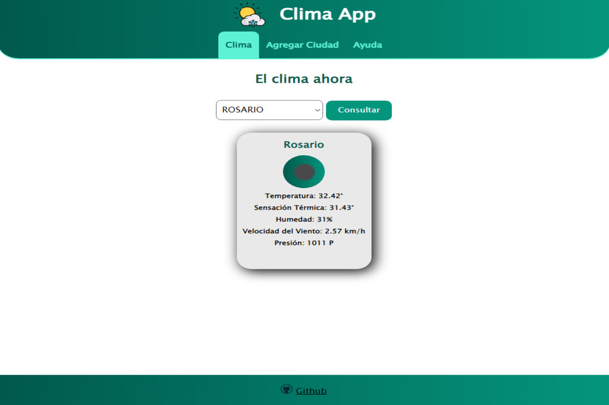

# Weather Project

This project is a web application that displays real-time weather in any location around the world. It has been built using HTML, CSS and JavaScript and uses the OpenWeatherMap API to get weather information.

## Features

- Displays the current temperature, humidity, pressure, and wind direction in real-time.
- Allows weather search by city.
- Displays an image on the screen based on current weather conditions.
- Responsive design, meaning it adapts to different screen sizes.

## Installation

To install this project, simply clone the repository and open the index.html file in your preferred browser.

## Usage

1. Open the index.html file in your preferred browser.
2. Enter a city or zip code in the search box.
3. Click the "Search" button to view the current weather information.

## API Key

This project uses the OpenWeatherMap API to get weather information. To use this application, you need to obtain a free API key from the OpenWeatherMap website. Once you have your API key, simply add

## Screenshot

  

## Test Project

> https://lucasbutto.github.io/Clima-App/index.html
